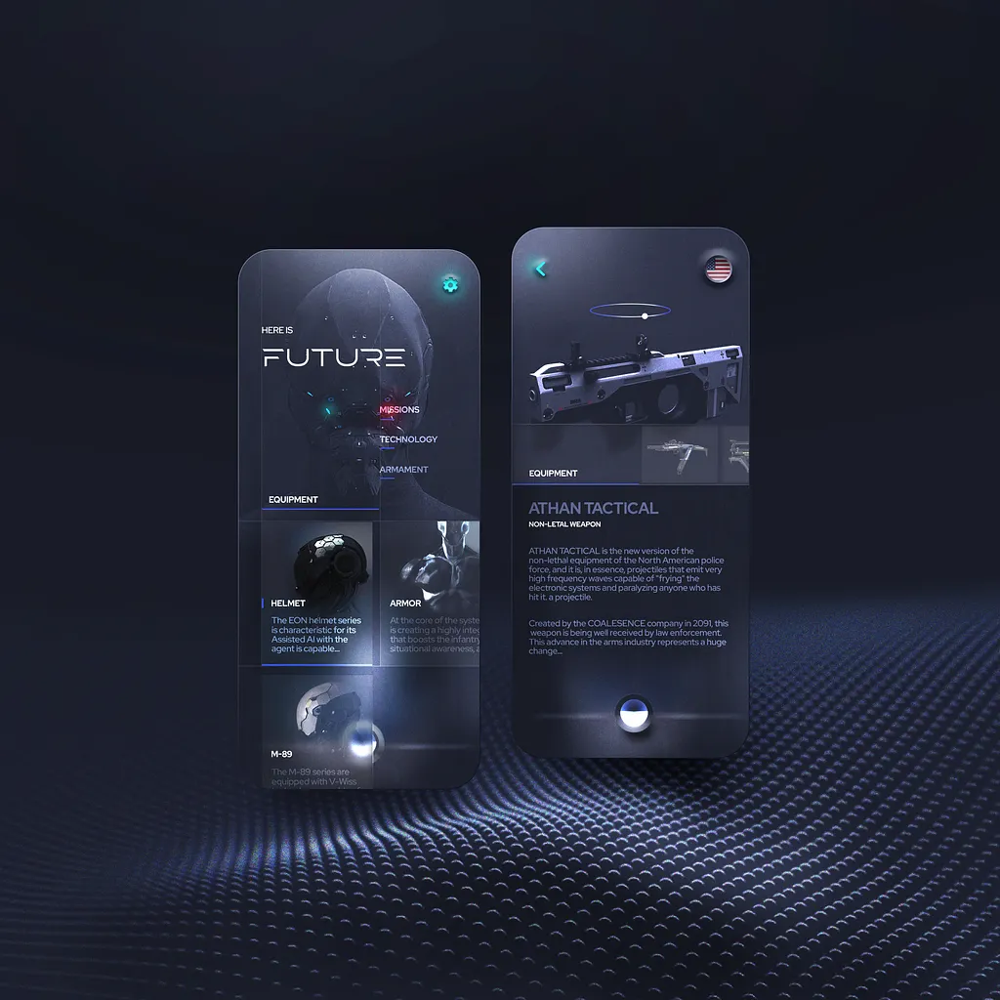

# **Umbral EdTech App – Project Requirements**
## **Overview**
**Umbral** is an AI-powered educational platform that revolutionizes learning by providing personalized, visual, and open access to knowledge.

The platform enables students to learn through **interactive concept graphs**, **multiple teaching methodologies**, and **AI-driven explanations** while maintaining **full ownership** and **portability** of their learning data through the **OpenFree context and memory export** system.

### **Core Value Proposition**
- OpenFree context and memory (downloadable and shareable).
- Visual concept mapping chats through interactive graphs.
- Multiple AI model selection.
- Personalized teaching methods (practical cases, concepts, analogies).
- Adaptive learning for different levels and topics.
- Generated learning roadmap and specific topic entry points.
- Optional voice and video narration by AI tutors.

## **Core Functionalities**
### **1. AI-Powered Chat System with Model Selection**
**Description:**  
Intelligent conversational interface allowing students to ask questions and receive explanations from AI tutors.

**Key Features:**
- Multi-model AI support (GPT-4, Claude, Llama, custom models).
- Real-time chat interface with context retention.
- Teaching method selection (practical, conceptual, analogical, step-by-step).
- Message history with full transcription.
- Code generation and image creation capabilities.
- Optional voice and video narration.
- Download conversation feature.
- OpenFree format export.

**User Roles:**  
Students, AI Tutor System, Administrators.

### **2. Interactive Concept Graph Visualization**
**Description:**  
Visual representation of knowledge domains showing how general concepts expand into specific topics.

**Key Features:**
- Interactive node-based graph.
- Three-tier structure: Core Concepts → Fundamental Pillars → Specific Subtopics.
- Click-to-explore (chat per concept).
- Expandable/collapsible nodes.
- Pan, zoom, and reorganize.
- Save and share maps.
- Visual connection lines between concepts.

**User Roles:**  
Students, Administrators.

### **3. Adaptive Course Generation**
**Description:**  
AI-generated personalized learning paths based on user goals and knowledge level.

**Key Features:**
- Knowledge-level assessment.
- Goal-setting interface.
- Dynamic curriculum generator.
- Progressive difficulty.
- Milestone tracking.
- Recommended learning sequences.

**User Roles:**  
Students, AI Tutor System.

### **4. Comprehensive Progress Tracking**
**Description:**  
System for tracking learning progress and identifying improvement areas.

**Key Features:**
- Concept mastery visualization.
- Time tracking per topic.
- Assessment and quiz scores.
- Learning streak tracking.
- Visual progress dashboards.
- Personalized recommendations.

**User Roles:**  
Students, Teachers/Instructors.

### **4. OpenFree Context & Memory System (Core Feature)**
**Description:**  
Data portability mechanics enabling full user ownership of learning data.

**Key Features:**
- Export all chat conversations in open format.
- Download complete learning history.
- Share learning paths.
- Import/export progress data.
- No vendor lock-in.
- API for third-party integration.
- Backup and restore functionality.

**User Roles:**  
Students, System Administrators.

### **5. Comprehension Evaluation System**
**Description:**  
Adaptive quizzes to verify understanding of learned concepts.

**Key Features:**
- Dynamic, topic-based question generation.
- Multiple question types.
- Immediate feedback and retry.
- Difficulty adjustment.
- Explanations for incorrect answers.

**User Roles:**  
Students, AI System.

### **6. Code and Visual Content Generation**
**Description:**  
Generative AI utilities for programming and visual learning assistance.

**Key Features:**
- Code snippet generation.
- Syntax highlighting and execution.
- Diagram and flowchart generation.
- Image creation for concepts.
- Interactive code playgrounds.
- Copy/download generated content.

**User Roles:**  
Students, AI System.

## **Technical Requirements**
### **Platform**
- **Primary:** Web application (responsive).

### **Frontend**
- Framework: **Next.js**.
- UI Library: **Tailwind CSS + shadcn/ui**.
- Visualization: **D3.js** or **Cytoscape.js**.
- State Management: **Redux Toolkit** or **Zustand**.
- Real-time: **Socket.io** or **WebSockets**.

### **Backend**
- API Framework: **Python (FastAPI)**.
- Real-time: **Socket.io / WebSocket server**.
- File Storage: **Azure Storage Account** or equivalent for fast prototype (e.g supabase)
- Background Jobs: **Bull Queue** or **Celery**.

### **AI Integration**
- Models: OpenAI (GPT-4), Anthropic (Claude), Meta Llama, Cohere.
- Model router/selector logic for multi-model support.

### **Database**
- Primary: **PostgreSQL**.
- Vector: **chroma**.
- Document: **MongoDB** or PostgreSQL **JSONB**.

### **Authentication & Security**
- Clerk

### **Infrastructure**
- Hosting: **Azure** or **Vercel**

## **User Roles**
| Role | Description |
|------|--------------|
| **Students** | Primary users; access learning features and data export. |
| **Teachers/Instructors** | Curate content, monitor progress, and guide learners. |
| **System Administrators** | Handle infrastructure, security, and data management. |

## **Non-Functional Requirements**
### **Security**
- Secure API key management.

### **Accessibility**
- Screen reader & keyboard navigation.
- High contrast mode.

## **Data Portability: OpenFree Standard**
**Key Principles:**
- JSON-based export format.
- Full data export within 24h.
- Import functionality.

## **Monetization Strategy**
### **Free Tier**
- Limited AI interactions.
- Basic concept libraries.
- Standard models.
- Community support.

### **Premium Tier**
- Unlimited AI usage.
- Newest/best models.
- Multimedia features.
- Priority support.
- Analytics and collaboration tools.

### **Enterprise/Education**
- Custom deployments.
- White-label options.
- Institutional dashboards.
- Bulk user management.
- SLA guarantees.

## **Additional Notes**
### **OpenFree Format Specification**
Includes:
- Chat transcripts with timestamps.
- User preferences.
- Progress and mastery levels.
- Learning paths.
- Assessments.
- Metadata for third-party use.
